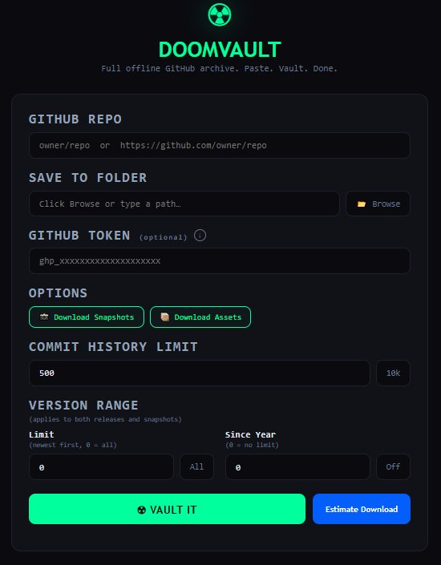
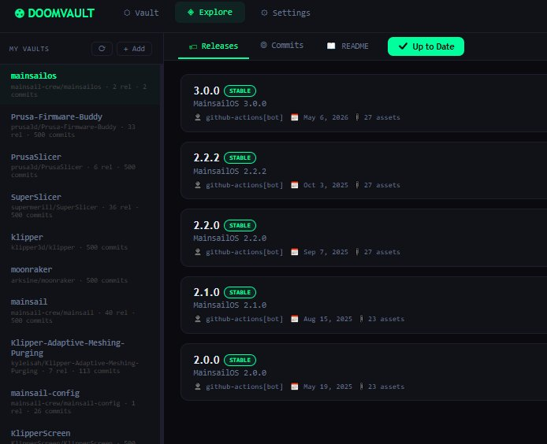
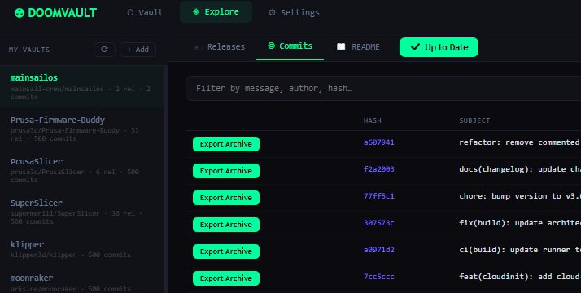

<div align="center">

# ☢ DoomVault

**Full offline GitHub archive. Paste. Vault. Done.**

A single-file Python desktop app that creates a complete offline archive of any GitHub repository — full git history, every release, all downloadable assets, and browsable snapshots — then opens a local web interface to explore it all.

</div>

<div align="center">



</div>

---

## What it does

DoomVault pulls down everything about a GitHub repo and stores it on your own disk so you can keep it, browse it, and use it with no internet connection:

- **Full git history** — a complete mirror clone, so every commit and every version is preserved.
- **Releases** — release notes (rendered just like GitHub), plus every downloadable asset.
- **Assets** — installers, binaries, firmware images, and source archives for each release.
- **Snapshots** — the full extracted source tree for each tag, ready to open as plain folders.
- **A local browser UI** — explore releases, commits, and the README without touching the network.

Everything runs locally. The only time DoomVault uses the network is while it's actually downloading the repo.

---

## Quick start

DoomVault is a **single Python file** with **no third-party dependencies** — it uses only the Python standard library.

1. Make sure you have [Python 3](https://www.python.org/downloads/) installed.
2. Download `doomvault.py`.
3. Double-click it (or run `python doomvault.py`).

The app starts a small local server and opens your browser automatically. On Windows, if Git isn't installed, DoomVault downloads and installs it for you.

> **Requirements:** Python 3 and Git. On Windows, Git is auto-installed if missing. On macOS/Linux, install Git yourself (`brew install git` or `sudo apt install git`). Linux users may also need `python3-tk` for the folder-picker.

---

## Creating a vault

Fill out the form, then hit **Vault It**.

<div align="center">


</div>

| Field | What it does |
| --- | --- |
| **GitHub Repo** | `owner/repo` or a full GitHub URL. |
| **Save To Folder** | Where the archive is written. Browse or type a path. |
| **GitHub Token** | Optional. Needed for 60+ API requests/hr or private repos. |
| **Download Snapshots** | Extract each tag's full source tree into browsable folders. |
| **Download Assets** | Download each release's attached files. |
| **Commit History Limit** | How many commits to record (preset button for 10k). |
| **Version Range** | Limit by count and/or year — applies to **both** releases and snapshots. |

Before committing to a large download, click **Estimate Download** to see the total size and time, broken down by component. DoomVault warns you (and turns the figure red) when an archive is going to be very large.

---

## Exploring a vault

Once a repo is vaulted, the **Explore** tab lets you browse it like a local, offline version of GitHub.

### Releases

Release notes are rendered in full GitHub-flavored Markdown, with a single-column asset list per release. Click any asset to reveal it in your file manager or copy it to Downloads.

<div align="center">



</div>

### Commits

Browse and search the full commit history. Click any commit to see its message, changed files, and a colorized diff. Every commit has an **Export Archive** button that extracts the repo exactly as it was at that point in history into a folder — non-destructively, leaving the rest of your vault untouched.

<div align="center">



</div>

### README

The repo's README is rendered with the same GitHub-style formatting, including embedded images.

### Tabs and updates

- **Reorder the tabs** (Releases / Commits / README) by dragging them — your arrangement is remembered.
- The **Download Updates** button checks GitHub for releases newer than the ones you've archived. It shows a count when updates exist, or turns green and reads **Up to Date** when you're current. Clicking it pulls in the new releases and their commits.

---

## Features at a glance

- 📦 **Complete archives** — git history, releases, assets, and snapshots in one folder.
- 🌐 **Fully offline** — browse everything with no internet, including a standalone `index.html` viewer written into each vault.
- 🧮 **Download estimates** — see size and time before you commit, with large-download warnings.
- 🔄 **Update checking** — know when new releases exist and pull them in with one click.
- 📤 **Export any version** — extract the repo at any commit or tag to a folder, on demand.
- 🎯 **Version filtering** — limit by release count or year for both releases and snapshots.
- 🪶 **Single file, zero dependencies** — just `doomvault.py` and the Python standard library.
- 🖥️ **Cross-platform** — works on Windows, macOS, and Linux.

---

## How a vault is stored

Each vault is a self-contained folder:

```
<repo>/
├── _git_mirror/        # complete git history (mirror clone)
├── _working_copy/      # checked-out working tree
├── releases/           # release metadata + downloaded assets
│   └── index.json
├── snapshots/          # extracted source tree per tag (optional)
├── index.html          # standalone offline browser for this vault
└── manifest.json       # summary of what was archived
```

Because the git mirror contains the **complete history**, every version of the repo is preserved even if you skip snapshots. Snapshots are just a convenience layer of pre-extracted folders — you can always extract any version later with **Export Archive**.

---

## Notes

- DoomVault is ad-free and stores everything locally; nothing is sent anywhere except requests to GitHub to fetch the repo you ask for.
- A GitHub token is never required, but it raises your API rate limit and is needed for private repos.
- Closing the browser tab shuts the app down automatically.

---

<div align="center">

**☢ DoomVault** — keep the repos that matter, before they disappear.

</div>
